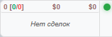
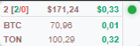

# Trade Activity GUI

A small always-on-top window that displays current positions and PNL in real time.




## What it does
- Fetches open positions
- Shows real-time PNL with color indication (green/red)
- Displays connection status indicator
- Stays on top without getting in the way

## Supported exchanges
- Bybit Futures

## Installation
Install the required version of Wails CLI (must match the project's go.mod):
```
go install github.com/wailsapp/wails/v2/cmd/wails@v2.12.0
```
## Configuration
Create a `.env` file in the project root directory with your Bybit API keys:

```
EXCHANGE_BYBIT_API_KEY=your_api_key_here
EXCHANGE_BYBIT_SECRET_KEY=your_secret_key_here
```

## Live Development
Run the application in development mode:

```
wails dev
```

## Building
To build a redistributable, production mode package:

**Option 1 — Using Make (Linux/macOS/WSL):**
```
make build
```

**Option 2 — Using build.bat (Windows):**
```
build.bat
```

**Option 3 — Manually:**
```
go install github.com/wailsapp/wails/v2/cmd/wails@v2.12.0
wails build
```
